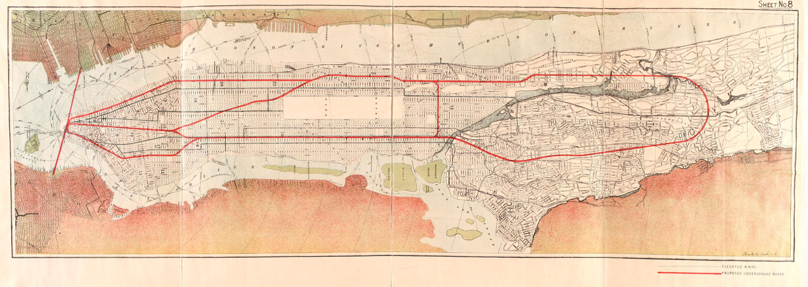

# Maps from Andrew Lynch’ talk at Transit Museum Meetup

Maps and notes from the presentation of [Andrew Lynch](http://vanshnookenraggen.com/) at the [meetup on Wednesday, November 1, 2017](https://www.meetup.com/historical-data-and-maps-at-nypl/events/244072360/) at the [New York Transit Museum](http://www.nytransitmuseum.org/). This meetup was part of the [Historical Maps & Data](https://www.meetup.com/historical-data-and-maps-at-nypl) meetup series of NYPL’s [NYC Space/Time Directory project](http://spacetime.nypl.org).

More information:

- [Transit maps and photos from the New York Public Library](https://github.com/bertspaan/nypl-talks/tree/gh-pages/ny-transit-museum)
- [NYC Space/Time Directory](http://spacetime.nypl.org)
- [New York Transit Museum](http://www.nytransitmuseum.org/)

## Maps

### 1870

Drawing showing Beach Pneumatic Subway under Broadway. The one track, one station subway was more of a demonstration than full transit project but it was an immediate success. Politics and stood in the way and funding dried up in the Panic of 1873.

### 1880

A proposed rapid transit subway network throughout New York City including a tunnel from New Jersey to Brooklyn.

### 1912

After the success of the first subway in 1904 the Public Service Commission of New York released a report looking at future subways. This map shows a proposed 3rd Ave Subway.

### 1920

The new Mayor John F. Hylan set out to build a publicly owned subway to compete with the private companies of the time. Chief Engineer Daniel Turner proposed a plan which would drape the entire city with lines. While most were fantasy some ideas were later incorporated into the Independent Subway.

### 1921

A subway to Staten Island had been proposed many times but the closest it ever came to being reality was in 1921 when ground was broken in Owls Head Park. Money ran out and the line was abandoned. This plan shows a 4 track tunnel with tracks for freight and passengers.

### 1929

The optimism of the 1920s gave rise to the expansive Independent Subway. Mere months before the stock market crash the city released an ambitious plan for a second phase of subway building. This is the first time the 2nd Ave Subway was proposed.

### 1939

After a decade of building and planning the city released an updated expansion plan with extensions deep into Queens and Staten Island. The nation’s entry into World War II ate up funds and these plans, too, were mothballed.

### 1947

After the War the subway saw a dramatic drop in ridership with the rise of suburbs and car travel. The city proposed a massive 6 track 2nd Ave Subway but expansions into the outer boroughs were scaled back to recapturing commuter rail lines.

### 1968

With the creation of the MTA the new agency was given a mandate to fix and expand the subway. Using funds available from the state and federal government the city finally broke ground on the 2nd Ave Subway along with the 63rd St Tunnel to Queens and the Archer Ave Subway in Jamaica. But soon the city was facing bankruptcy and the proposed expansions were scaled back or canceled. The Archer Ave Subway and 63rd St Tunnels were eventually opened in 1988 and 2001, respectively, and part of the tunnels built for the 2nd Ave Subway were used when the line resumed construction in 2007.

### 2015

A future subway vision by artist Andrew Lynch. Lynch has spent years documenting failed subway projects and has come up with his own series of plans for expansion which can be found on his website [vanshnookenraggen.com](http://vanshnookenraggen.com/).

